# EPROJECT - HỆ THỐNG BÁN HÀNG MICROSERVICES (Docker + CI/CD)

## Thông tin sinh viên
- **Sinh viên thực hiện:** Đặng Thị Thanh Bình - 22673421
- **Lớp:** DHHTTT18A
- **Môn học:** Lập trình hướng dịch vụ
- **Giảng viên hướng dẫn:** Huỳnh Nam

---

## 1. Mục tiêu & Vấn đề hệ thống giải quyết
Hệ thống mô phỏng **quy trình mua hàng trực tuyến**, bao gồm các chức năng:
- Người dùng đăng ký và đăng nhập bằng tài khoản riêng.
- Người dùng xem sản phẩm, thêm vào giỏ và đặt hàng.
- Dữ liệu người dùng và sản phẩm được quản lý bởi các dịch vụ tách biệt (microservices).

Mục tiêu:
- Ứng dụng **kiến trúc Microservices** trong Node.js.
- Triển khai toàn bộ hệ thống qua **Docker Compose**.
- Tích hợp **CI/CD pipeline** bằng **GitHub Actions**.
- Thực hiện kiểm thử API bằng **Postman**.

---

## 2. Kiến trúc hệ thống

### Thành phần dịch vụ

| Service | Ý nghĩa | Cổng mặc định |
|----------|------------|----------------|
| **API Gateway** | Cổng giao tiếp trung tâm, định tuyến request tới các service con | `3003` |
| **Auth Service** | Xử lý đăng ký, đăng nhập, xác thực JWT | `3000` |
| **Product Service** | Quản lý sản phẩm, thêm mới, xem danh sách | `3001` |
| **Order Service** *(tuỳ chọn)* | Tạo và quản lý đơn hàng | `3002` |
| **MongoDB** | Lưu trữ dữ liệu người dùng và sản phẩm | `27017` |
| **(Có thể) Common Utils**| Chứa các tiện ích dùng chung (như isAuthenticated.js)|

### Sơ đồ hoạt động tổng quát
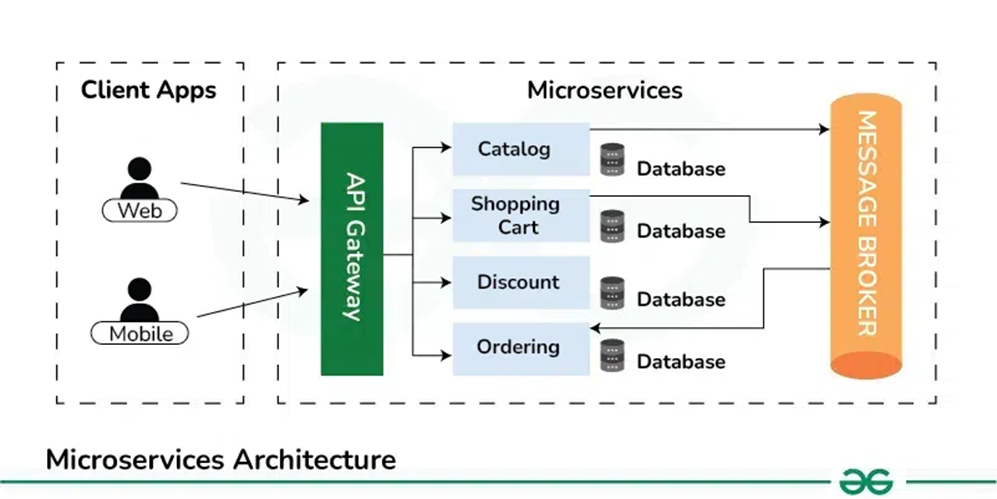

## 3. Triển khai trên Docker
- Bước 1: Mỗi dịch vụ tạo một file Dockerfile.
- Bước 2: Cấu hình cho file docker-compose.yml
- Bước 3: Chạy lệnh: docker compose up -d
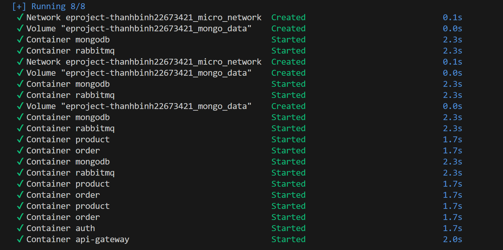
- Bước 4: Xem trạng thái hoạt động của các dịch vụ dùng lệnh: docker ps
- Sau đó, tất cả dịch vụ sẽ được đẩy lên docker, đóng gói thành các container
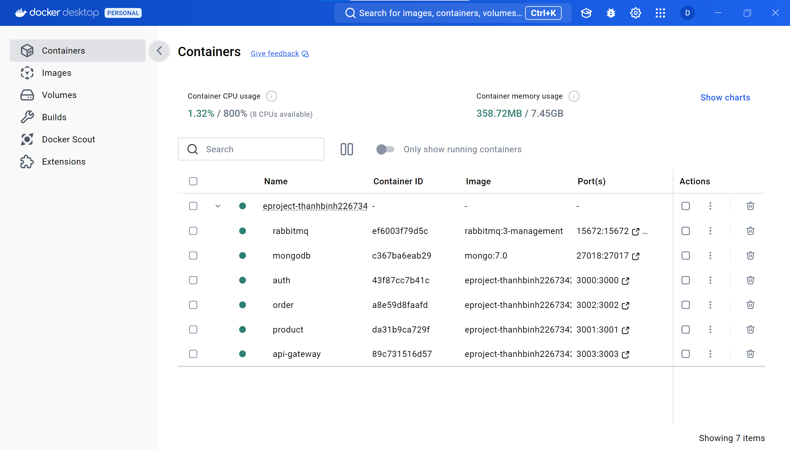
---
### 4. Test POSTMAN
- Đăng ký
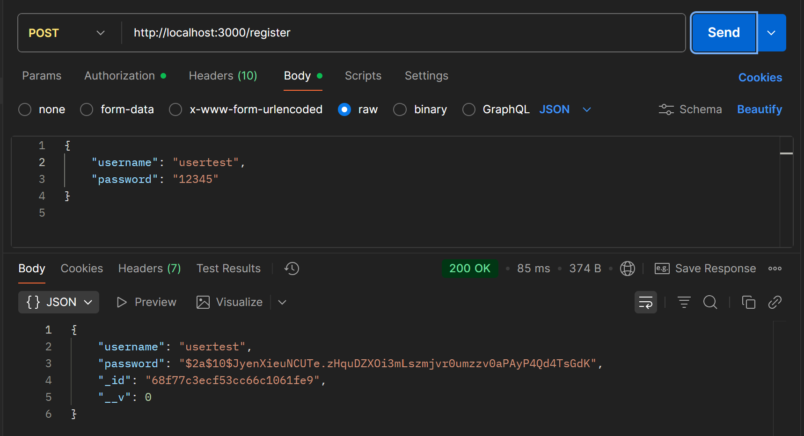

- Đăng nhập
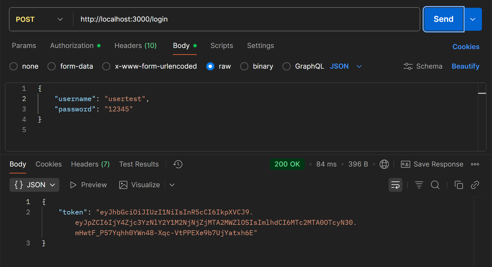

- Xem profile
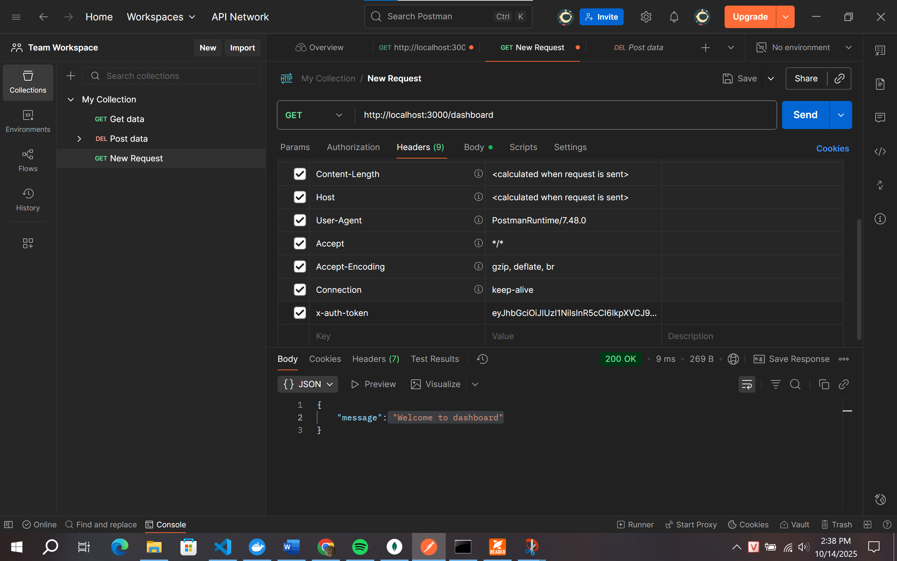

- Thêm sản phẩm
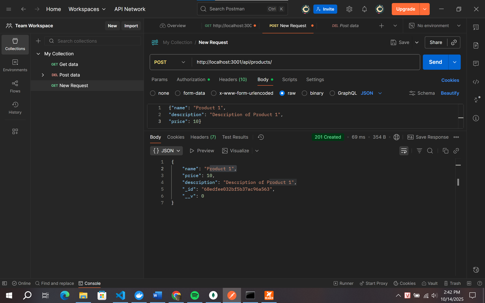
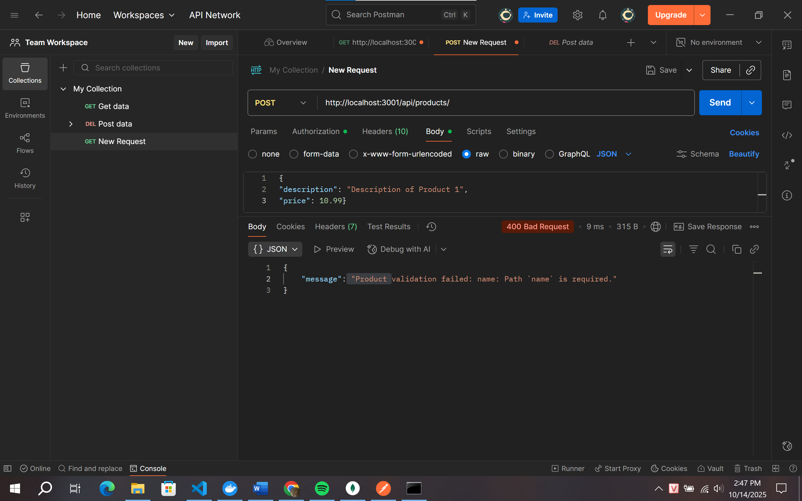

- Xem sản phẩm
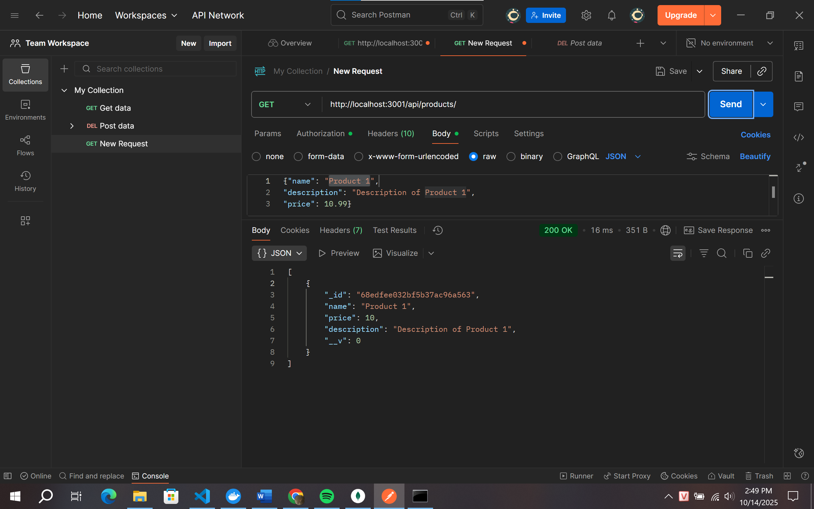

- Mua sản phẩm
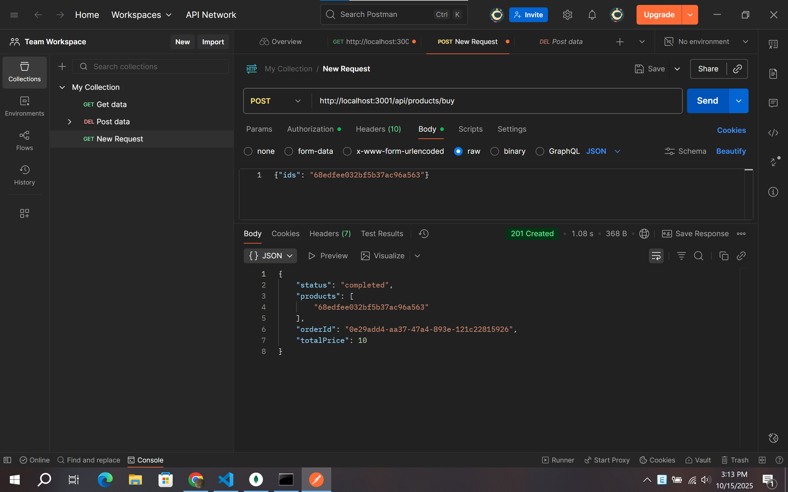
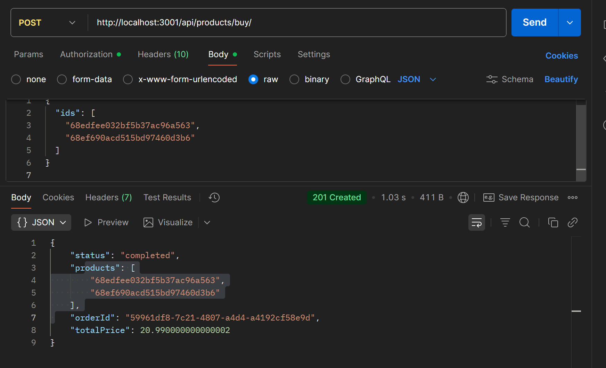

---

### 5. Các mẫu thiết kế được sử dụng
- **Gateway Pattern:** Dùng trong `api-gateway` để định tuyến các request đến đúng service (`auth`, `product`, `order`).
- **Repository Pattern:** Tách riêng lớp truy cập dữ liệu trong các service giúp dễ bảo trì và test.
- **JWT Authentication:** Sử dụng JSON Web Token để xác thực người dùng sau khi đăng nhập.
- **Dependency Injection (đơn giản):** Các module được import và sử dụng qua tham số, tránh phụ thuộc trực tiếp.
> Các mẫu trên giúp hệ thống dễ mở rộng, bảo trì và triển khai CI/CD.

### 6. Các dịch vụ giao tiếp như thế nào

Hệ thống áp dụng mô hình **Microservices Architecture**, trong đó các dịch vụ (Auth, Product, Order, v.v.) **giao tiếp với nhau thông qua API Gateway và Message Broker**.

**Giao tiếp đồng bộ (HTTP – REST API)**  
   - Mọi request từ client (Web hoặc Mobile) đều đi qua **API Gateway**.  
   - Gateway định tuyến request đến đúng microservice tương ứng:
     - `/api/auth/*` → Auth Service  
     - `/api/product/*` → Product Service  
     - `/api/order/*` → Order Service  
   - Các service phản hồi dữ liệu JSON qua Gateway → trả lại client.

**Giao tiếp bất đồng bộ (Message Broker – RabbitMQ)**  
   - Các service có thể trao đổi thông tin gián tiếp qua **Message Broker** (như RabbitMQ, Kafka).  
   - Ví dụ: khi người dùng đặt hàng → Order Service phát sự kiện `"ORDER_CREATED"` → các service khác (Inventory, Notification) có thể nhận sự kiện và xử lý mà không cần gọi trực tiếp.
   
---

### 7. Kết luận
- Hệ thống triển khai thành công bằng Docker.
- Các API hoạt động qua Gateway, xác thực JWT đầy đủ.
- Toàn bộ API được kiểm thử qua Postman minh chứng.
